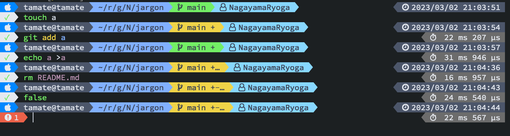

# jargon

Asynchronous ZSH prompt.



## Usage

```sh
# .zshrc
eval "$(jargon init)"
```

## Installation

### Build from source

```sh
$ go install github.com/NagayamaRyoga/jargon@latest
```

### From prebuilt binary

https://github.com/NagayamaRyoga/jargon/releases

### Using [zinit](https://github.com/zdharma-continuum/zinit)

```sh
# .zshrc
zinit light-mode from'gh-r' as'program' for \
    atclone'./jargon init >jargon.zsh; zcompile jargon.zsh' atpull'%atclone' \
    src'jargon.zsh' \
    @'NagayamaRyoga/jargon'
```
